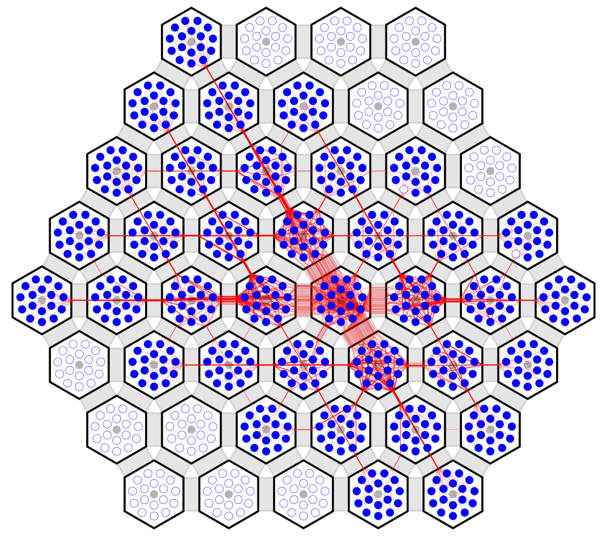
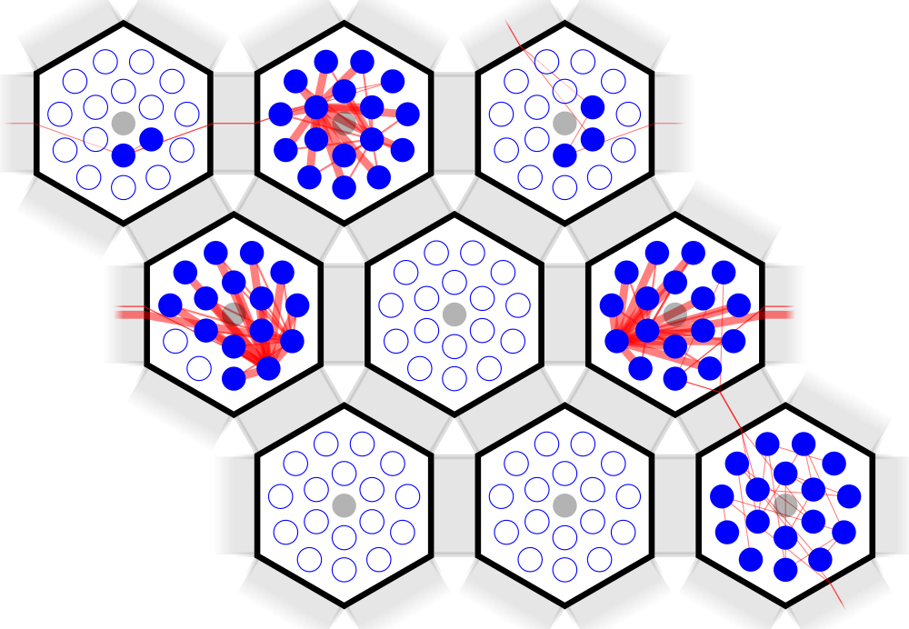
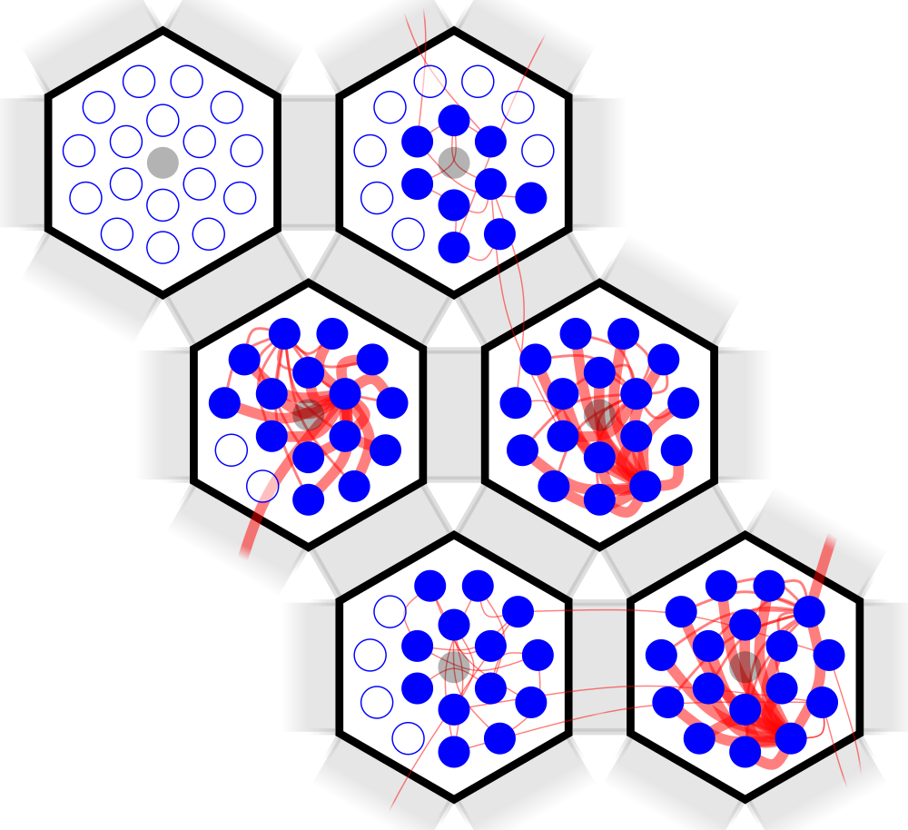

P&Rspective: SpiNNaker place & route diagram generation tools
=============================================================

When working on place and route for SpiNNaker applications it is often useful to
generate diagrams of the resulting placements. This library aims to produce
attractive and informative placement and routing diagrams from the data types
used by [Rig](https://github.com/project-rig/rig)'s place and route flow.

Gallery
-------

A fully placed and routed netlist:

A smaller fully placed and routed netlist showing wrap-around links:

Another smaller example but this time with routes replaced with a ratsnest:

Commandline Utility
-------------------

A command-line utility called `parspective` is included with the package which
can render diagrams of pickled netlists such as those produced by
`nengo_spinnaker`'s `nengo_spinnaker.utils.place_and_route.pickle_netlist`
function. Basic usage looks something like:

    $ parspective netlist.pcl out.png

See `parspective --help` for more command line options.

The command-line tool expects a picked Python dictionary which has a subset of
the following entries:

* `"vertices_resources"`: Chip resources used.
* `"nets"`: Nets in the network.
* `"machine"`: The machine to place/route within.
* `"constraints"`: Placement/routing constraints.
* `"placements"`: A valid set of placements.
* `"allocations"`: A valid set of allocations.
* `"routes"`: A valid set of routes.
* `"chip_style"`: A P&Rspective Style object.
* `"link_style"`: A P&Rspective Style object.
* `"core_style"`: A P&Rspective Style object.
* `"net_style"`: A P&Rspective Style object.

If `vertices_resources` or nets are not supplied, the diagram will simply be a
picture of the chips, links and cores available in the supplied machine.

If `placements`, `allocations` or `routes` is missing, the default Rig algorithm
for each will be used to generate them. This may take some time and so the `-v`
option may comfort users of a nervous disposition.

If a `machine` isn't supplied, a SpiNN-5 board will be selected by default.

If `constraints` aren't supplied, a constraint will be added which reserves core
0 as the monitor core. `-M` disables this.

If any of the `*_style` options are given, the supplied Style object will be
used to style the relevant part of the diagram. See the [Diagram
module][parspective/diagram.py] for further details. Unless the `-C` option is
used, cores reserved by constraints will automatically be styled in translucent
grey.
